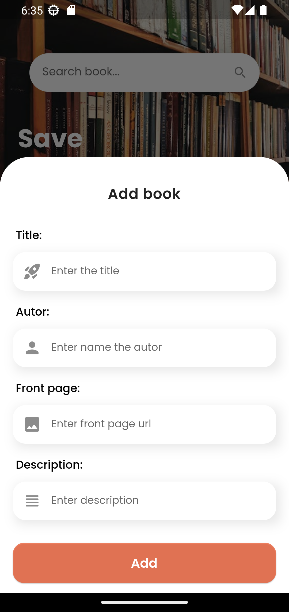
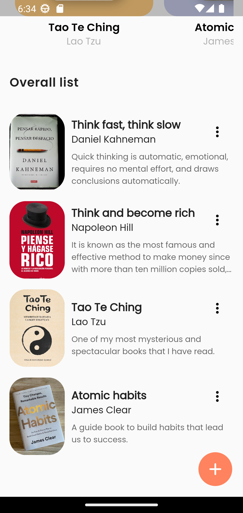

# App book
Application to save books, or simulate a bookstore, developed with Flutter, it has a database. 

## Development 

### Project structure

In the `assets` folder are all the files used by the application.

- **themes:** Files that contain the theme of the application.
- **screen:** The screen that the user can see.
- **widget:** They are like components, the screen folder depends on them.
- **models:** Models i use in db folder.
- **database:** I use it as a database in the application.
- **modal:** Modal for the app.


### My experience developing

 - This mobile application for Android has been developed using Flutter, a technology that allows you to create applications quickly and efficiently. The development experience was very smooth and easy, allowing me to create a CRUD with SQLite efficiently. Even though it's a relatively simple app, I'm proud of the end result and think it shows Flutter's potential as a platform for developing high-quality, modern mobile apps.

### Technologies used in the project

1. [Flutter](https://flutter.dev/)
2. [Dart](https://dart.dev/)
#### Flutter package
- [google_fonts](https://pub.dev/packages/google_fonts)
- [sqflite](https://pub.dev/packages/sqflite)
- [path](https://pub.dev/packages/path)
- [path_provider](https://pub.dev/packages/path_provider)


## Demo 

You can see the app running, just open the terminal and enter the following commands:
```
git clone https://github.com/YerikAH/book_app.git
cd book_app
flutter run
```
If you want to try the application on android you can see [releases](https://github.com/YerikAH/book_app/releases/tag/book_app), and download the apk, it weighs 19MB.

### Screenshots





## Author

- Harvey Yerik

    - [Web site](https://portfolio-harvey.netlify.app/)
    - [Twitter](https://twitter.com/yerikhar)
    - [GitHub](https://github.com/YerikAH)
    - [Send Me A Message](https://yerikah.github.io/send-me-a-message/dist/)
